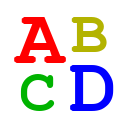

# Quiz for Autogenerated Vocabulary List
This is an extension to improve vocabulary by answering quiz from a vocabulary list generated based on your search history.

Words are registered to vocabulary list only when you use below websites.
* [Google Translate](https://translate.google.com/)
* [ALC](https://eow.alc.co.jp/)
* [Weblio](https://ejje.weblio.jp/)

## How to build
```shell script
$ ./gradlew build
# ---> You will get zip file at build/quiz.zip
#      and unpacked files at build/unpacked. You can use this for development.
```
## Internal design
[Please check the readme in background module.](background/readme.md)
