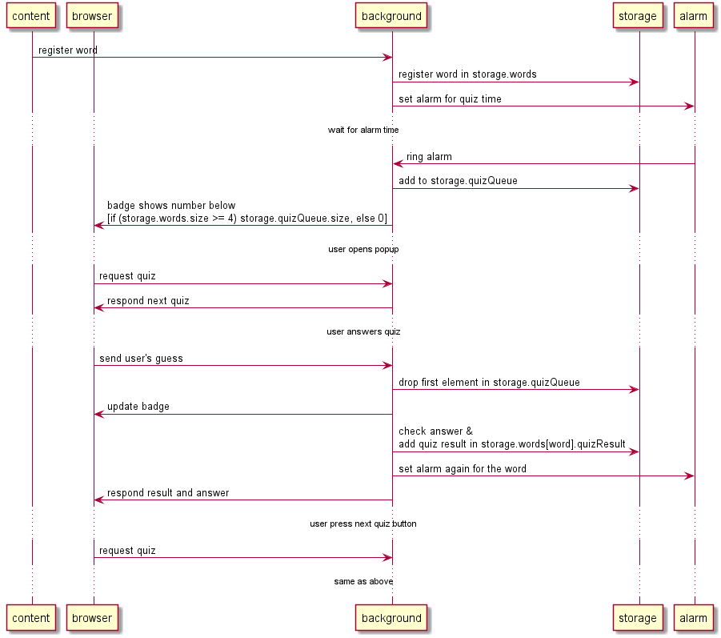

# Sequence diagram of how word is registered and quiz is generated.


# Storage Design
chrome.storage.sync
```
{
  "words": {
    "foo": {
      "translation":  "フー",
      "quizResult": [ true, false, true, true ]
    },
    "bar": {
      "translation":  "バー",
      "quizResult": [ true, false, true, false ]
    }
  },
  "quizQueue": [ "foo", "bar" ],
  "quiz": {
    "foo": {
      "choices":[ <choice1>, <choice2>, <choice3>, <choice4> ],
      "expected": 2
    }
  },
  "alarm": { "dummy": 12345 }
}
```
| Key | Value |
|----|----|
| words | registered words. |
| words[key].translation | translation for registered word. |
| words[key].quizResult | array of boolean for history of quiz results. |
| quizQueue | words in queue for quiz. |
| quiz | current active quiz content. if user closes browserAction without answering, this data remains even though it'll never used. |
| quiz[key].choices | choices provided to client. |
| quiz[key].expected | correct answer index number [0, 4] (4 means non of above). |
| alarm | dummy data for firing storage.onChange on alarm change. |

# Message Design
## registerWord
content_script -> background
### request
```
{ "msgType": "registerWord",
  "word": <targetWordString>,
  "translation": <targetWordTranslationString> }
```
### response
none.

## requestQuiz
browser_action -> background
### request
```
{ "msgType": "requestQuiz" }
```
### response
```
{ "word": <wordInQueue>,
  "choices":[ <choice1>, <choice2>, <choice3>, <choice4> ] }
```
## answerQuiz
browser_action -> background
### request
```
{ "msgType": "answerQuiz",
  "word": <wordForQuiz>,
  "actual": <index> }
```
index range is [0, 4]
### response
```
{ "result": <Boolean>,
  "expected": <index> }
```
## option page related messages
omitted
