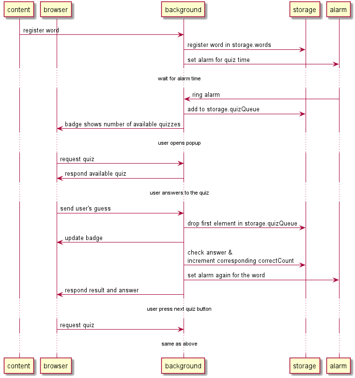

# Sequence diagram of how word is registered and quiz is generated.


# Storage Design
chrome.storage.sync
```
{
  "storage_version": "2"
  "words-enja": {
    "foo": {
      "translation": "フー",
      "correctCount": 3
    }
  },
  "words-jaen": {
    ...
  },
  "quizQueue": [
    {
      "language": "enja",
      "word": "foo"
    },
    ...
  ],
  "quiz": {
    "language": "enja"
    "foo": {
      "choices":[ <choice1>, <choice2>, <choice3>, <choice4> ],
      "expected": 2
    }
  },
  "alarm": { "dummy": 12345 }
}
```

| Key | Value |
|----|----|
| words-\<srcLang>\<dstLang> | Registered words for specific src/dst language. Current available languages are srcLang=en, dstLang=ja. |
| words-\<>\<>[\<word>].translation | Translation for the word. |
| words-\<>\<>[\<word>].correctCount | Count of correct for its quiz. |
| quizQueue[] | Words in queue for quiz. |
| quizQueue[].language | Src/dst language of the word in queue. |
| quizQueue[].word | Word in queue. |
| quiz | Current active quiz content. If user closes browserAction without answering, this data remains even though it'll never be used. |
| quiz.language | Src/dst language of the word. |
| quiz[\<word>].choices | Choices provided to client. |
| quiz[\<word>].expected | Correct answer index number [0, 4] (4 means non of the above). |
| alarm | Dummy data for firing storage.onChange on alarm change. |

# Message Design
## registerWord
content_script -> background
### request
```
{ "msgType": "registerWord",
  "language": "<srcLang><dstLang>"
  "word": <targetWordString>,
  "translation": <targetWordTranslationString> }
```
### response
none.

## requestQuiz
browser_action -> background
### request
```
{ "msgType": "requestQuiz" }
```
### response
```
{ "word": <wordInQueue>,
  "choices":[ <choice1>, <choice2>, <choice3>, <choice4> ] }
```
## answerQuiz
browser_action -> background
### request
```
{ "msgType": "answerQuiz",
  "language": "<srcLang><dstLang>
  "word": <wordForQuiz>,
  "actual": <index> }
```
index range is [0, 4]
### response
```
{ "result": <Boolean>,
  "expected": <index> }
```
## option page related messages
omitted
